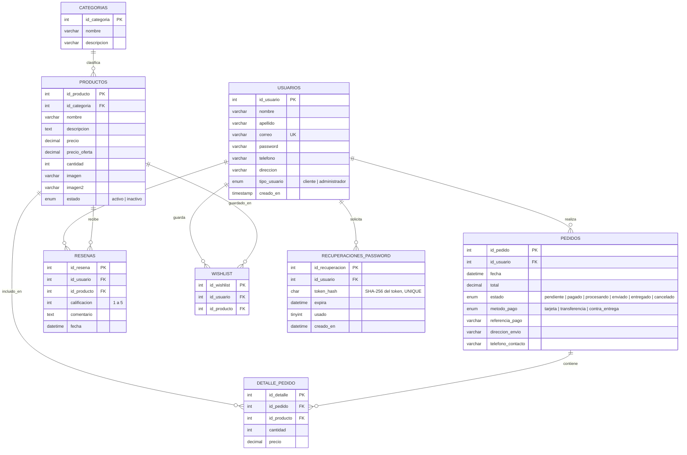

# Esquema de la base de datos — Modelo relacional (MySQL)

Generado a partir de [techstore.sql](techstore.sql). Base de datos: `tienda_online`.

## Notas del diseño

- **usuarios → pedidos / resenas / wishlist** (1 a N): un usuario puede tener varios
  pedidos, reseñas y productos en su lista de deseos.
- **categorias → productos** (1 a N): cada producto pertenece a una sola categoría.
- **pedidos → detalle_pedido → productos** (N a N resuelto con tabla intermedia): un pedido
  incluye varios productos y un producto puede estar en varios pedidos; `detalle_pedido`
  guarda además el `precio` congelado al momento de la compra (no se recalcula si el
  producto cambia de precio después).
- **resenas**: relaciona usuario y producto; a nivel de aplicación (no de esquema) solo se
  permite crear una reseña si el usuario ya compró ese producto (`Resena::crear()` en
  `model/Resena.php`), verificando contra `detalle_pedido`.
- Todas las llaves foráneas usan `INT` con `FOREIGN KEY` explícita para mantener integridad
  referencial (por ejemplo, no se puede borrar una categoría con productos asociados sin
  antes resolver esa relación).

## Modelo NoSQL

El diseño equivalente en MongoDB (colecciones, qué se embebe y qué se referencia, documentos
de ejemplo, índices y consultas) está en [modelo-nosql.md](modelo-nosql.md).

La aplicación usa una única base de datos relacional (MySQL) porque no hay datos con
estructura variable o de alto volumen no relacional que justifiquen NoSQL — todas las entidades (usuarios, productos, pedidos, reseñas) tienen relaciones
fijas y se benefician de integridad referencial y transacciones (por ejemplo, al crear un
pedido se descuenta stock y se inserta el detalle dentro de una misma transacción, ver
`Pedido::crear()` en `tienda-online/model/Pedido.php`).
