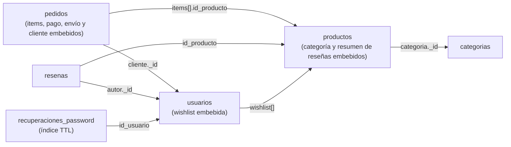

# Modelo NoSQL — TechStore (MongoDB)

Diseño equivalente al [modelo relacional](diagrama-relacional.md), pensado para una base de
datos **orientada a documentos (MongoDB)**. El proyecto se implementó con MySQL (ver la
comparación al final), pero este modelo muestra cómo se organizarían los mismos datos si la
tienda usara NoSQL.

En MongoDB no hay tablas ni `JOIN`: los datos se guardan como **documentos JSON** dentro de
**colecciones**, y cada decisión de diseño es elegir entre **embeber** (guardar los datos dentro
del documento que los usa) o **referenciar** (guardar el `_id` de otro documento).

## Colecciones



| Colección | Equivale a (MySQL) | Qué se embebe | Qué se referencia |
|---|---|---|---|
| `usuarios` | `usuarios` + `wishlist` | La lista de deseos (arreglo de `_id` de productos) | — |
| `categorias` | `categorias` | — | — |
| `productos` | `productos` | Copia de la categoría (`_id` + nombre) y el resumen de reseñas | La categoría, por `_id` |
| `pedidos` | `pedidos` + `detalle_pedido` | Los items (con nombre y precio al momento de comprar), el pago, el envío y los datos del cliente | El cliente y cada producto, por `_id` |
| `resenas` | `resenas` | Nombre del autor y del producto (para mostrarlas sin consultas extra) | El usuario y el producto, por `_id` |
| `recuperaciones_password` | `recuperaciones_password` | — | El usuario, por `_id` |

## Por qué embeber o referenciar

- **Items dentro del pedido (embebido).** Un pedido siempre se lee completo junto con sus
  productos y nunca cambia después de pagarse. Guardar nombre y precio **al momento de la
  compra** es además lo correcto: si el producto cambia de precio mañana, el pedido de hoy debe
  seguir mostrando lo que se cobró. Reemplaza la tabla intermedia `detalle_pedido`.
- **Wishlist dentro del usuario (embebido).** Es una lista corta, solo la usa ese usuario y se
  lee siempre junto con él. Reemplaza la tabla `wishlist`.
- **Reseñas en su propia colección (referenciado).** Un producto puede acumular cientos de
  reseñas: embeberlas haría crecer el documento sin límite (MongoDB tiene un máximo de 16 MB
  por documento) y obligaría a reescribir el producto con cada reseña nueva. En el producto
  solo se guarda un **resumen** (promedio, total y distribución) que se actualiza al publicar
  una reseña.
- **Categoría copiada en el producto (desnormalizado).** El catálogo muestra y filtra por
  nombre de categoría en cada tarjeta; copiarla evita una segunda consulta. Si se renombra una
  categoría, se actualizan sus productos con un solo `updateMany`.

## Documentos de ejemplo

### `usuarios`

```json
{
  "_id": ObjectId("66f0a1c2e4b0a1b2c3d4e507"),
  "nombre": "Sofía",
  "apellido": "Ramírez",
  "correo": "sofia.ramirez@correo.com",
  "password": "$2y$10$0SshLKTskLrk67/7oHDx1O...",
  "telefono": "55557001",
  "direccion": "Zona 14, Ciudad de Guatemala",
  "tipo_usuario": "cliente",
  "creado_en": ISODate("2026-09-14T09:50:00Z"),
  "wishlist": [
    ObjectId("66f0a1c2e4b0a1b2c3d4e562"),
    ObjectId("66f0a1c2e4b0a1b2c3d4e565")
  ]
}
```

### `categorias`

```json
{
  "_id": ObjectId("66f0a1c2e4b0a1b2c3d4e103"),
  "nombre": "Audífonos",
  "descripcion": "Audífonos con y sin cable"
}
```

### `productos`

```json
{
  "_id": ObjectId("66f0a1c2e4b0a1b2c3d4e526"),
  "nombre": "Apple AirPods Pro 2",
  "descripcion": "Inalámbricos, cancelación de ruido activa",
  "categoria": { "_id": ObjectId("66f0a1c2e4b0a1b2c3d4e103"), "nombre": "Audífonos" },
  "precio": 1699.00,
  "precio_oferta": null,
  "cantidad": 14,
  "imagenes": ["airpods_pro2.png", "airpods_pro2_2.png"],
  "estado": "activo",
  "vendidos": 1,
  "resumen_resenas": {
    "promedio": 5.0,
    "total": 1,
    "distribucion": { "5": 1, "4": 0, "3": 0, "2": 0, "1": 0 }
  }
}
```

`imagenes` reemplaza las columnas `imagen` / `imagen2`: en un documento se puede guardar una
lista de cualquier tamaño sin cambiar el esquema.

### `pedidos`

```json
{
  "_id": ObjectId("66f0a1c2e4b0a1b2c3d4e606"),
  "numero": 6,
  "fecha": ISODate("2026-09-14T10:12:00Z"),
  "estado": "entregado",
  "cliente": {
    "_id": ObjectId("66f0a1c2e4b0a1b2c3d4e507"),
    "nombre": "Sofía Ramírez",
    "correo": "sofia.ramirez@correo.com"
  },
  "items": [
    { "id_producto": ObjectId("66f0a1c2e4b0a1b2c3d4e526"), "nombre": "Apple AirPods Pro 2", "cantidad": 1, "precio": 1699.00 },
    { "id_producto": ObjectId("66f0a1c2e4b0a1b2c3d4e555"), "nombre": "Funda para iPhone 15", "cantidad": 1, "precio": 99.00 }
  ],
  "total": 1798.00,
  "pago": { "metodo": "tarjeta", "referencia": "Tarjeta •••• 4242" },
  "envio": { "direccion": "Zona 14, Ciudad de Guatemala", "telefono": "55557001" }
}
```

### `resenas`

```json
{
  "_id": ObjectId("66f0a1c2e4b0a1b2c3d4e707"),
  "id_producto": ObjectId("66f0a1c2e4b0a1b2c3d4e526"),
  "producto": "Apple AirPods Pro 2",
  "autor": { "_id": ObjectId("66f0a1c2e4b0a1b2c3d4e507"), "nombre": "Sofía R." },
  "calificacion": 5,
  "comentario": "La cancelación de ruido es impresionante, los uso todos los días en el bus.",
  "fecha": ISODate("2026-09-18T10:12:00Z")
}
```

### `recuperaciones_password`

```json
{
  "_id": ObjectId("66f0a1c2e4b0a1b2c3d4e801"),
  "id_usuario": ObjectId("66f0a1c2e4b0a1b2c3d4e507"),
  "token_hash": "3f8a…(SHA-256 del token)",
  "usado": false,
  "expira": ISODate("2026-09-22T20:30:00Z")
}
```

## Índices

| Colección | Índice | Para qué |
|---|---|---|
| `usuarios` | `{ correo: 1 }` único | Login y evitar cuentas duplicadas (como `UNIQUE` en MySQL) |
| `productos` | `{ "categoria._id": 1, estado: 1 }` | Filtrar el catálogo por categoría |
| `productos` | `{ nombre: "text", descripcion: "text" }` | Búsqueda por texto (RF05) |
| `productos` | `{ vendidos: -1 }`, `{ "resumen_resenas.promedio": -1 }` | Ordenar por popularidad (RF06) |
| `pedidos` | `{ "cliente._id": 1, fecha: -1 }` | Historial de pedidos de un cliente (RF12) |
| `resenas` | `{ id_producto: 1, fecha: -1 }` | Reseñas de un producto, más recientes primero |
| `resenas` | `{ id_producto: 1, "autor._id": 1 }` | Saber si un cliente ya reseñó un producto |
| `recuperaciones_password` | `{ token_hash: 1 }` único | Buscar el token del enlace |
| `recuperaciones_password` | `{ expira: 1 }` con `expireAfterSeconds: 0` (TTL) | MongoDB borra solo los tokens vencidos |

## Operaciones principales

**Catálogo filtrado y ordenado por más vendidos (RF04–RF06):**

```js
db.productos.find(
  { estado: "activo", "categoria.nombre": "Audífonos", precio: { $gte: 1000, $lte: 2000 } }
).sort({ vendidos: -1 })
```

**Registrar un pedido sin sobreventa (RF11).** El descuento de stock solo se aplica si todavía
hay existencias; si alguna actualización no modifica nada, se aborta la transacción (equivale al
`SELECT … FOR UPDATE` + `ROLLBACK` de `Pedido::crear()` en MySQL):

```js
const sesion = db.getMongo().startSession();
sesion.startTransaction();
for (const item of items) {
  const r = db.productos.updateOne(
    { _id: item.id_producto, cantidad: { $gte: item.cantidad } },
    { $inc: { cantidad: -item.cantidad, vendidos: item.cantidad } },
    { session: sesion }
  );
  if (r.modifiedCount === 0) { sesion.abortTransaction(); throw new Error("Stock insuficiente"); }
}
db.pedidos.insertOne({ cliente, items, total, pago, envio, estado: "pagado", fecha: new Date() }, { session: sesion });
sesion.commitTransaction();
```

**Historial de un cliente (RF12)**, sin `JOIN` porque los items están dentro del pedido:

```js
db.pedidos.find({ "cliente._id": idUsuario }).sort({ fecha: -1 })
```

**¿El cliente compró el producto? (requisito para reseñar, RF14):**

```js
db.pedidos.findOne({ "cliente._id": idUsuario, "items.id_producto": idProducto })
```

**Promedio y distribución de reseñas (página de reseñas):**

```js
db.resenas.aggregate([
  { $group: { _id: "$calificacion", cantidad: { $sum: 1 } } },
  { $sort: { _id: -1 } }
])
```

## Relacional vs. NoSQL para esta tienda

| Aspecto | MySQL (implementado) | MongoDB (este modelo) |
|---|---|---|
| Estructura | Tablas con columnas fijas y llaves foráneas | Documentos JSON flexibles dentro de colecciones |
| Relaciones | `JOIN` entre tablas (`pedidos` + `detalle_pedido` + `productos`) | Datos embebidos o referencias por `_id` |
| Integridad | La base de datos la garantiza (FK, `UNIQUE`, `CHECK`) | La garantiza la aplicación (validaciones e índices únicos) |
| Consistencia de stock | Transacción con `FOR UPDATE` | Actualización condicional (`$gte`) dentro de una transacción |
| Historial de pedidos | Consulta con `JOIN` | Una sola lectura del documento |
| Cambios de esquema | `ALTER TABLE` (ver las migraciones en `database/`) | Se agregan campos sin migrar |
| Precio histórico | Se copia en `detalle_pedido.precio` | Se copia en `items[].precio` |

**Por qué se eligió MySQL:** los datos de la tienda tienen una estructura fija y relaciones
claras (un pedido pertenece a un usuario, un producto a una categoría) y las operaciones más
delicadas —cobrar y descontar stock— necesitan integridad referencial y transacciones, que un
motor relacional ofrece de forma nativa. MongoDB sería una buena opción si el catálogo tuviera
atributos muy distintos por tipo de producto (por ejemplo, especificaciones técnicas diferentes
para laptops y audífonos) o un volumen de lecturas mucho mayor.
